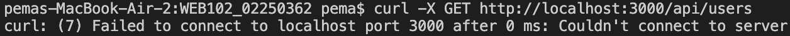

# RESTful API Server 

## Project Overview

In this practical, I built a RESTful API server using Node.js and Express. The purpose of this project was to understand how backend systems work by creating APIs that handle users, videos, and comments. I implemented CRUD operations and tested the endpoints using tools like curl and Postman.

---

## Technology Stack

- **Runtime:** Node.js
- **Framework:** Express.js
- **Middleware:** CORS, Morgan (logging), Body-parser
- **Development Tool:** Nodemon
- **Testing Tools:** curl, Postman
- **Language:** JavaScript

---

## Setup Instructions

### 1. Clone or Download the Project

I first ensured that the project folder was available on my system.

### 2. Navigate to Server Folder

```bash
cd server
```

### 3. Install Dependencies

```bash
npm install
```

### 4. Setup Environment Variables

I created a `.env` file and added:

```env
PORT=3000
NODE_ENV=development
```

### 5. Run the Server

```bash
npx nodemon src/app.js
```

If nodemon was not installed:

```bash
npm install nodemon --save-dev
```

### 6. Confirm Server is Running

I verified the server by checking this output:

```
Server running on http://localhost:3000 in development mode
```

---

## API Testing

I tested the API using curl commands:

### Get All Users
```bash
curl -X GET http://localhost:3000/api/users
```

### Get All Videos
```bash
curl -X GET http://localhost:3000/api/videos
```

### Get User by ID
```bash
curl -X GET http://localhost:3000/api/users/1
```

### Get Video by ID
```bash
curl -X GET http://localhost:3000/api/videos/1
```

### Get User Videos
```bash
curl -X GET http://localhost:3000/api/users/1/videos
```

### Get Video Comments
```bash
curl -X GET http://localhost:3000/api/videos/1/comments
```

---

## Screenshots

### Server Running

*(Insert screenshot of server running successfully)*

---

## Features Implemented

- RESTful API structure
- CRUD operations for:
  - Users
  - Videos
  - Comments
- Like and follow functionality
- In-memory database (mock data)
- Error handling
- Middleware: CORS, Logging, Parsing

---

## API Endpoints Summary

| Method | Endpoint | Description |
|--------|----------|-------------|
| GET | `/api/users` | Get all users |
| GET | `/api/users/:id` | Get user by ID |
| GET | `/api/videos` | Get all videos |
| GET | `/api/videos/:id` | Get video by ID |
| GET | `/api/users/:id/videos` | Get videos by a specific user |
| GET | `/api/videos/:id/comments` | Get comments for a specific video |
| POST | `/api/users` | Create a new user |
| POST | `/api/videos` | Create a new video |
| POST | `/api/comments` | Add a comment |
| PUT | `/api/users/:id` | Update a user |
| PUT | `/api/videos/:id` | Update a video |
| DELETE | `/api/users/:id` | Delete a user |
| DELETE | `/api/videos/:id` | Delete a video |

---

## Challenges Faced

During this practical, I encountered several problems:

### Challenge 1: Module Not Found Errors
**Issue:** Missing controller files caused module not found errors.  
**Solution:** I ensured all required controller files were created and properly exported.

### Challenge 2: Inaccurate File Paths and Structure
**Issue:** The project structure was not organized correctly, leading to import errors.  
**Solution:** I reorganized the folder structure following best practices (controllers, routes, middleware, utils).

### Challenge 3: Server Not Running Due to Incorrect Entry File
**Issue:** The server would not start because I was using `index.js` instead of `app.js`.  
**Solution:** I updated the entry point in `package.json` or used the correct filename (`src/app.js`).

### Challenge 4: Curl Not Working


**Issue:** curl commands failed when the server was not running.  
**Solution:** I ensured the server was running before executing any curl commands.

### Challenge 5: Environment Variables and Template Literals Problems
**Issue:** Environment variables were not being read correctly, and template literals had syntax errors.  
**Solution:** I double-checked the `.env` file syntax, ensured `dotenv` was configured at the top of `app.js`, and fixed template literal syntax.

These were resolved by ensuring accuracy in file structure, debugging the code, and ensuring the server was running before executing the code.

---

## What I Learned

- How RESTful APIs work
- How to structure a backend project
- How to handle HTTP requests and responses
- How to debug server-side errors
- How to test APIs using curl and Postman
- The importance of proper error handling
- How middleware functions work in Express

---

## Conclusion

The practical has helped me gain a better understanding of backend development. I have been able to create a fully functional API server. I have also been able to debug real-world problems. This has helped me gain a deeper understanding of server-side programming and has equipped me with the skills I need to handle more advanced programming tasks.

---

## References

- Express.js Documentation: https://expressjs.com
- Node.js Documentation: https://nodejs.org
- curl Documentation: https://curl.se
- Postman: https://postman.com
- REST API Tutorial: https://restfulapi.net
